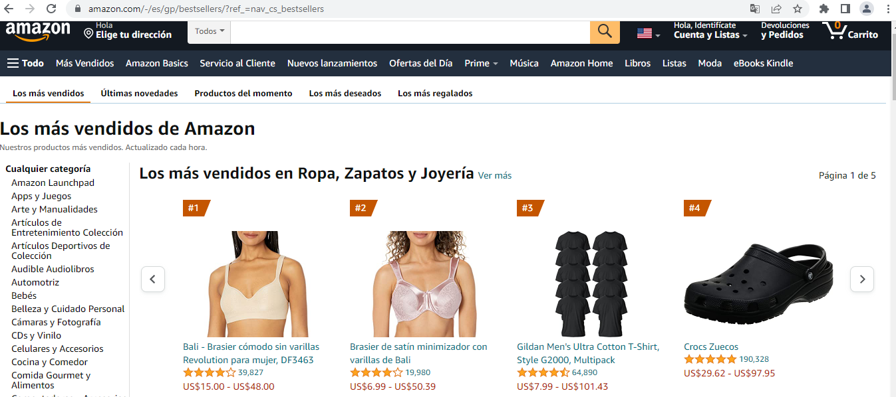
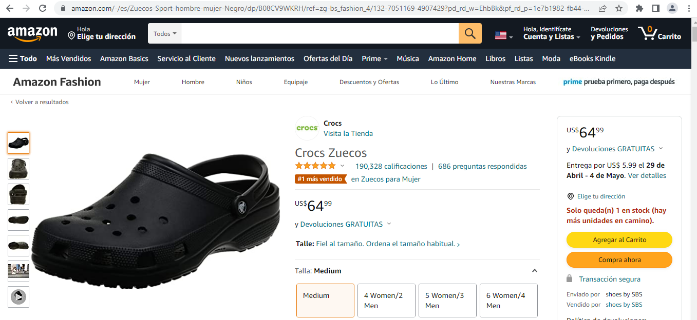
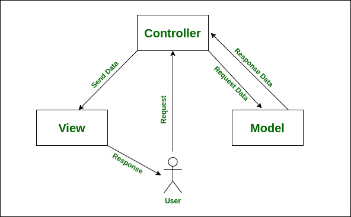
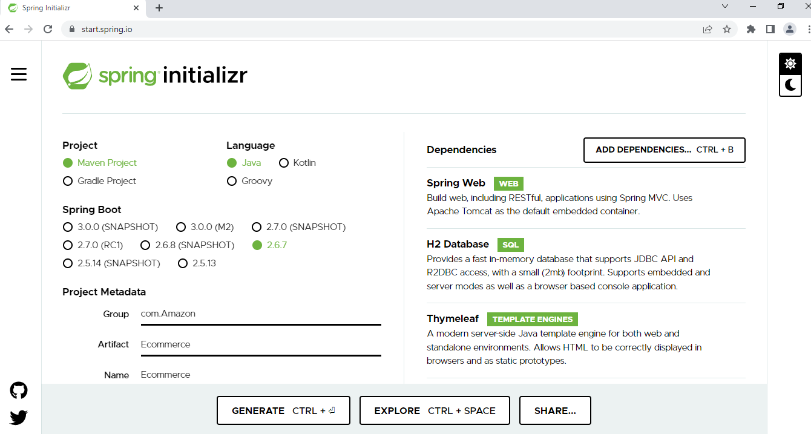
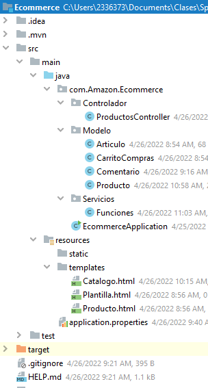
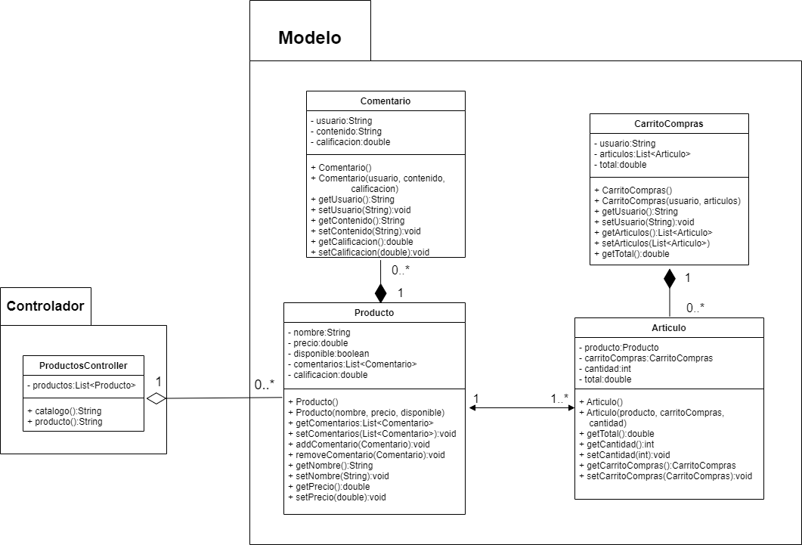
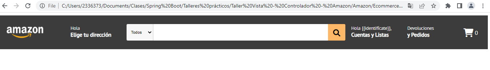
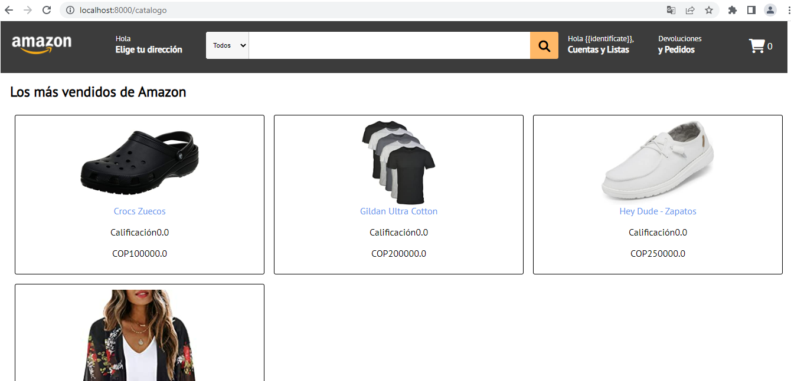
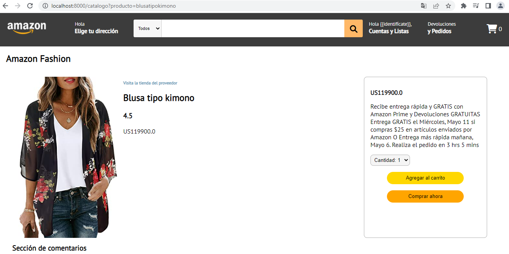
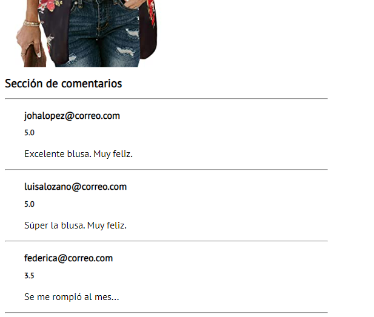

<h1 align="center"><strong>Taller Práctico: Vista - Controlador</strong></h1>

## __Introducción__

La mayoría de los desarrollos de software (aplicaciones web, móviles o de escritorio) se pueden subdividir en tres componentes principales: frontend, backend y base de datos. Spring Boot surgió como una herramienta que simplifica el desarrollo backend, y con la cual es posible hacer desarrollo de aplicaciones web al integrar los tres componentes con el patrón de desarrollo MVC (Modelo - Vista - Controaldor). 

En el presente taller, construiremos parte de una aplicación web _ecommerce_, orientado a la relación __Vista - Controlador__.

## __1. Objetivo__

El objetivo de este trabajo es la construir la comunicación entre la _Vista_ (desarrollo frontend) y el _Controlador_ (lógica backend). El tema de este taller está basado en la plataforma ecommerce de Amazon, principalmente en la sección de productos:



<p align="center"><i>Figura 1.</i> Sección de productos de Amazon.</p>

Una vez el usuario identifica y selecciona el producto que desea, debe poder avanzar a la sección personalizada del producto; donde puede acceder a información detallada del producto. Como se muestra en la Figura 2.



<p align="center"><i>Figura 2.</i> Sección de producto.</p>

## __2. Desarrollo backend__

Spring está basado en el patrón de diseño MVC (Modelo - Vista  Controlador), resumido en la Figura 3.



<p align="center"><i>Figura 3.</i> Patrón de diseño MVC.</p>

Iniciamos creando el proyecto Spring en [Spring initalizer](https://start.spring.io/) seleccionando las siguientes dependencias:



<p align="center"><i>Figura 4.</i> Inicialización del proyecto Spring.</p>

De las dependencias:

* Spring Web: se emplea para crear el servidor local en Tomcat.
* H2 DataBase: lo usaremos en el futuro como sistema de gestión de bases de datos.
* Thymeleaf: se trata del motor de plantillas HTML para nuestro desarrollo frontend.

Generamos el archivo ZIP y lo descomprimimos en una ubicación de interés. Luego, lo abrimos con __IntelliJ__. Allí, estructuraremos nuestro árbol de directorios de la siguiente forma:

<div align="center">



<p><i>Figura 5.</i> Árbol de directorios del proyecto.</p>

</div>


La distribución del directorio se basó en el diagrama UML mostrado en la Figura 6.



<p align="center"><i>Figura 6.</i> Diagrama UML del desarrollo backend.</p>

### __2.1. Modelo__

Iniciamos construyendo las clases del _Modelo_ con base en el diagrama UML (Figura 6); comenzando por la clase __Comentario__.

```JAVA
package com.Amazon.Ecommerce.Modelo;

public class Comentario {
    private String usuario;
    private String contenido;
    private double calificacion;
    
    public Comentario() {
        this.usuario = "test";
    }

    public Comentario(String usuario, String contenido, double calificacion) {
        this.usuario = usuario;
        this.contenido = contenido;
        this.calificacion = calificacion;
    }

    public String getUsuario() {
        return usuario;
    }

    public void setUsuario(String usuario) {
        this.usuario = usuario;
    }

    public String getContenido() {
        return contenido;
    }

    public void setContenido(String contenido) {
        this.contenido = contenido;
    }

    public double getCalificacion() {
        return calificacion;
    }

    public void setCalificacion(double calificacion) {
        this.calificacion = calificacion;
    }
}
```

La clase _Comentario_ se trata de un clásico POJO (_"Plain Old Java Object"_). Es decir, un objeto convencional con constructores básicos y _getters/setters_.

La clase __Producto__ sería la siguiente:

```JAVA
package com.Amazon.Ecommerce.Modelo;

import java.util.ArrayList;
import java.util.List;

public class Producto {
    private String nombre;
    private String url;
    private double precio;
    private boolean disponible;
    private String foto;
    private List<Comentario> comentarios;
    private double calificacion;

    public Producto() {
        this.comentarios = new ArrayList<>();
        this.calificacion = 0.0;
    }

    public Producto(String nombre, double precio, boolean disponible, String foto) {
        this();
        this.nombre = nombre;
        this.precio = precio;
        this.disponible = disponible;
        this.foto = foto;
        this.url = Funciones.nombreUrl(nombre);
    }

    public Producto(String nombre, double precio, boolean disponible, String foto, List<Comentario> comentarios) {
        this(nombre, precio, disponible, foto);
        this.comentarios = comentarios;
    }

    public String getUrl() {
        return url;
    }

    public void setUrl(String url) {
        this.url = url;
    }

    public String getFoto() {
        return foto;
    }

    public void setFoto(String foto) {
        this.foto = foto;
    }

    public String getNombre() {
        return nombre;
    }

    public void setNombre(String nombre) {
        this.nombre = nombre;
    }

    public double getPrecio() {
        return precio;
    }

    public void setPrecio(double precio) {
        this.precio = precio;
    }

    public boolean isDisponible() {
        return disponible;
    }

    public void setDisponible(boolean disponible) {
        this.disponible = disponible;
    }

    public List<Comentario> getComentarios() {
        return comentarios;
    }

    public void setComentarios(List<Comentario> comentarios) {
        this.comentarios = comentarios;
    }

    public double getCalificacion() {
        if (this.calificacion == 0) {
            for (Comentario comentario : this.comentarios) {
                this.calificacion += comentario.getCalificacion();
            }
            this.calificacion /= this.comentarios.size();
        }
        return this.calificacion;
    }

    public void setCalificacion(double calificacion) {
        this.calificacion = calificacion;
    }
}
```

Para esta etapa inicial, será suficiente trabajar con las clases _Producto_ y _Comentario_.

#### 2.1.1 Testing

Ahora, crearemos un test unitario para la clase _Producto_ con el fin de probar la funcionalidad del método __getCalificacion__.

```JAVA
package com.Amazon.Ecommerce.Modelo;

import org.junit.jupiter.api.BeforeAll;
import org.junit.jupiter.api.Test;

import java.util.ArrayList;
import java.util.Arrays;
import java.util.List;

import static org.junit.jupiter.api.Assertions.*;

class ProductoTest {

    private static List<Comentario> comentarios;

    @BeforeAll
    public static void setUpClass() {
        comentarios = new ArrayList<>(Arrays.asList(
                new Comentario("prueba", 3.2),
                new Comentario("prueba2", 4.3)
        ));
    }

    @Test
    public void testCalificacionSinComentarios() {
        Producto pera = new Producto();
        assertEquals(0, pera.getCalificacion());
    }

    @Test
    public void testCalificacion () {
        Producto manzana = new Producto();
        manzana.setComentarios(comentarios);

        assertEquals((3.2+4.3)/2, manzana.getCalificacion());
    }
}
```

### __2.2. Controlador__

Tiene la responsabilidad de controlar toda la lógica backend y de conectar tanto el _Modelo_ como la _Vista_. Para este caso, construiremos la clase __ProductController__ (ver Figura 6) que permita obtener una lista _predefinida_ de productos y comentarios para enviarla a las plantillas Thymeleaf.

A su vez, se dispondrán de dos secciones:

* __Catálogo:__ sección en dónde se mostrarán todos los productos ofrecidos.
* __Producto:__ sección de compra de un producto. Permite observar los comentarios y la retroalimentación del mismo.

```JAVA
package com.Amazon.Ecommerce.Controlador;

import com.Amazon.Ecommerce.Modelo.Comentario;
import com.Amazon.Ecommerce.Modelo.Producto;
import com.Amazon.Ecommerce.Servicios.Funciones;
import org.springframework.stereotype.Controller;
import org.springframework.ui.Model;
import org.springframework.web.bind.annotation.GetMapping;
import org.springframework.web.bind.annotation.RequestParam;

import java.util.ArrayList;
import java.util.Arrays;
import java.util.List;

@Controller
public class ProductosController {
    private static List<Producto> productos;
    static {
        productos = new ArrayList<>(Arrays.asList(
                new Producto("Crocs Zuecos", 100_000, true, "https://m.media-amazon.com/images/I/81WnMBnbWSL._AC_UX500_.jpg"),
                new Producto("Blusa tipo kimono", 119_900, true, "https://m.media-amazon.com/images/I/81QIH1ZMspS._AC_UY500_.jpg",
                        new ArrayList<>(Arrays.asList(
                                new Comentario("johalopez@correo.com", "Excelente blusa. Muy feliz.", 5.0),
                                new Comentario("luisalozano@correo.com", "Súper la blusa. Muy feliz.", 5.0),
                                new Comentario("federica@correo.com", "Se me rompió al mes...", 3.0)
                                )))
        ));
    }

    public static List<Producto> getProductos() {
        return productos;
    }

    @GetMapping("/catalogo")
    public String getCatalogo(@RequestParam(value = "nombre", required = false,
                                defaultValue = "") String nombreProducto, Model model) {
        if (nombreProducto.length() > 0) {
            model.addAttribute("producto", Funciones.getProducto(productos, nombreProducto));
            return "Producto";
        } else {
            model.addAttribute("productos", productos);
            return "Catalogo";
        }
    }

}
```

#### 2.2.1 Testing

Ahora, probaremos la integración de nuestro _Controlador_ con una serie de tests. 

```JAVA
package com.Amazon.Ecommerce.Controlador;

import org.junit.jupiter.api.Test;
import org.springframework.beans.factory.annotation.Autowired;
import org.springframework.boot.test.autoconfigure.web.servlet.WebMvcTest;
import org.springframework.http.MediaType;
import org.springframework.test.web.servlet.MockMvc;
import static org.springframework.test.web.servlet.request.MockMvcRequestBuilders.get;

import static org.junit.jupiter.api.Assertions.*;
import static org.springframework.test.web.servlet.result.MockMvcResultMatchers.*;

@WebMvcTest(ProductosController.class)
class ProductosControllerTest {

    @Autowired
    private MockMvc mock;

    @Test
    public void testProductos() {
        assertEquals(2, ProductosController.getProductos().size());
    }

    @Test
    public void testCatalogo() throws Exception {
        mock.perform(get("/catalogo").accept(MediaType.TEXT_HTML))
                .andExpect(status().isOk())
                .andExpect(view().name("Catalogo"))
                .andExpect(model().attribute("productos", ProductosController.getProductos()));
    }

    @Test
    public void testProducto() throws Exception {
        mock.perform(get("/catalogo").param("nombre", "crocszuecos").accept(MediaType.TEXT_HTML))
                .andExpect(status().isOk())
                .andExpect(view().name("Producto"))
                .andExpect(model().attribute("producto", ProductosController.getProductos().get(0)));
    }
}
```

## __3. Desarrollo frontend__

Para el desarrollo frontend, utilizaremos __Thymeleaf__ como motor de plantillas HTML. En este punto, ya tenemos probados los _Modelos_, _Controladores_ y los _Servicios_ de nuestro proyecto. Es decir, el desarrollo backend es funcional y garantiza el envío de datos al frontend.

### __3.1. Formato__

El formato se trata de la plantilla base de nuestro desarrollo, que contiene la distribución en común de las demás vistas; tanto del _Catálogo_ como del _Producto_. En este caso, esta plantilla contendrá el menú de navegación.

#### 3.1.1 HTML

El desarrollo HTML es el siguiente:

```HTML
<html>
    <head th:fragment="head">
        <title>Amazon ecommerce</title>
        <meta charset="utf-8">
        <link rel="stylesheet" href="../static/css/navegador.css" th:href="@{/css/navegador.css}">
        <link rel="stylesheet" href="../static/css/catalogo.css" th:href="@{/css/catalogo.css}">
        <link rel="stylesheet" href="../static/css/producto.css" th:href="@{/css/producto.css}">
        <link rel="preconnect" href="https://fonts.googleapis.com">
        <link rel="preconnect" href="https://fonts.gstatic.com" crossorigin>
        <link rel="stylesheet" href="../static/css/fontawesome/css/fontawesome.min.css" th:href="@{/css/fontawesome/css/fontawesome.min.css}">
        <link rel="stylesheet" href="../static/css/fontawesome/css/solid.min.css" th:href="@{/css/fontawesome/css/solid.min.css}">
        <link href="https://fonts.googleapis.com/css2?family=PT+Sans&display=swap" rel="stylesheet">
    </head>
    <body>
        <nav th:fragment="nav">
            <a th:href="@{/catalogo}">
                
            </a>
            <ul>
                <li><a href="">
                    Hola <br> <b>Elige tu dirección</b>
                </a></li>
                <li class="filtro"><form action="">
                    <select name="" id="">
                        <option value="">Todos</option>
                    </select>
                    <input type="text" name="" id="">
                    <button><i class="fa-solid fa-magnifying-glass fa-xl"></i></button>
                </form></li>
                <li><a href="">
                    Hola {{identifícate}}, <br> <b>Cuentas y Listas</b>
                </a></li>
                <li><a href="">
                    Devoluciones <br> <b>y Pedidos</b>
                </a></li>
                <li class="filtro">
                    <i class="carrito fa-solid fa-cart-shopping fa-xl"></i> 0
                </li>
            </ul>            
        </nav>
    </body>
</html>
```

#### 3.1.2 CSS

Los estilos CSS, almacenados en el archivo __navegador.css__ son:

```CSS
body {
    font-family: 'PT Sans', sans-serif;
    font-size: 1rem;
}

nav {
    background-color: rgb(60, 60, 60);
    width: 100%;
    display: grid;
    grid-template-columns: 8% 92%;
    align-items: center;
}

nav img {
    width: 100%;
    padding: 1rem;
}

nav ul {
    padding-left: 5rem;
    width: 100%;
    display: grid;
    grid-template-columns: 12.5% 50% 12.5% 12.5% 12.5%;
    text-decoration: none;
}

nav ul li {
    list-style-type: none;
    padding: 0.5rem;
    color: white;
}

nav ul li:hover {
    border: 0.1rem solid white;
}

nav ul li a {
    text-decoration: none;
    color: white;
    padding-top: 2rem;
    font-size: 0.8rem;
}

nav ul li a b {
    font-size: 0.95rem;
}

nav ul li i {
    padding-top: 1.5rem;
}

.filtro form {
    width: 100%;
    display: grid;
    grid-template-columns: 12% 80% 8%;
    height: 100%;
}


.filtro select {
    background-color: rgb(247, 247, 247);
    border:none;
    border-radius: 0.2rem 0 0 0.2rem;
    padding: 0.5rem;
    font-size: 0.7rem;
}

.filtro input {
    border: none;
    border-left: 0.1rem solid rgb(201, 201, 201);
}

.filtro input:hover {
    border: none;

}

.filtro button {
    background-color: rgb(255, 184, 103);
    border:none;
    border-radius: 0 0.2rem 0.2rem 0;
    display: grid;
    grid-template-columns: 1fr;
}

.filtro:hover {
    border: none;
}
```

Que darán como resultado:



<p align="center"><i>Figura 7.</i> Menú de navegación.</p>

### __3.2. Catálogo__

La sección del _Catálogo_ se organiza de tal forma que todos los productos de Amazon puedan ser visibles y accesibles por parte los usuarios, como se aprecia en la Figura 1. 

Esta sección extiende el desarrollo del capítulo 3.1. 

#### 3.2.1 HTML

El desarrollo HTML se puede apreciar a continuación.

```HTML
<html>
<head th:replace="Plantilla :: head"></head>
<body>
    <nav th:replace="Plantilla :: nav"></nav>

    <div class="contenido">
        <h1><b>Los más vendidos de Amazon</b></h1>
    
        <div class="catalogo">
            <th:block th:each="producto : ${productos}">
                <div class="articulo">
                    
                    <br>
                    <a class="link" th:text="${producto.getNombre()}" th:href="@{/catalogo?producto={producto}(producto =${producto.getUrl()})}"></a>
                    <p th:text='Calificación + ${producto.getCalificacion()}'></p>
                    <p th:text="COP + ${producto.getPrecio()}"></p>
                </div>
            </th:block>
        </div>
    </div>
</body>
</html>
```

#### 3.2.2 CSS

Los estilos aplicados en el archivo __catalogo.css__ son:

```CSS
h1 {
    font-size: 1.5rem;
}

h2 {
    font-size: 1rem;
}

.contenido {
    margin-left: 1rem;
}

.catalogo {
    display: grid;
    grid-template-columns: 1fr 1fr 1fr;
    width: 100%;
}

.articulo {
    border: 0.1rem solid black;
    border-radius: 0.2rem;
    text-align: center;
    margin: 0.5rem;
    padding: 0.5rem;
}

.articulo img {
    width: 50%;
}

.articulo a {
    text-decoration: none;
}

.link {
    color: cornflowerblue;
}
```

Lo que nos dará como resultado:



<p align="center"><i>Figura 8.</i> Sección de catálogo.</p>

### __3.3. Producto__

Finalmente, para la sección de producto (basado en la Figura 2), desarrollaremos la Vista de la siguiente forma.

#### 3.3.1 HTML

El desarrollo HTML de la plantilla __Producto.html__ se aprecia a continuación:

```HTML
<html>
    <head th:replace="Plantilla :: head"></head>
    <body>
        <nav th:replace="Plantilla :: nav"></nav>

        <div class="producto">
            <h1>Amazon Fashion</h1>
            <div class="info-producto">
                
                <div class="contenido-producto">
                    <h2>Visita la tienda del proveedor</h2>
                    <h1 th:text="${producto.getNombre()}"></h1>
                    <h3 th:text="${producto.getCalificacion()}"></h3>
                    <p th:text="US + ${producto.getPrecio()}"></p>
                </div>
                <div class="seccion-compra">
                    <h2 th:text="US + ${producto.getPrecio()}"></h2>
                    <p>Recibe entrega rápida y GRATIS con Amazon Prime y Devoluciones GRATUITAS 
                        Entrega GRATIS el Miércoles, Mayo 11 si compras $25 en artículos enviados por Amazon
                        O Entrega más rápida mañana, Mayo 6. Realiza el pedido en 3 hrs 5 mins</p>
                    <select name="" id="">
                        <option value="1">Cantidad: 1</option>
                        <option value="2">Cantidad: 2</option>
                        <option value="3">Cantidad: 3</option>
                        <option value="4">Cantidad: 4</option>
                        <option value="5">Cantidad: 5</option>
                    </select>
                    <div class="acciones-compra">
                        <button class="agregar-carrito">Agregar al carrito</button>
                        <button class="comprar-producto">Comprar ahora</button>
                    </div>
                </div>
            </div>
        </div>

        <div class="seccion-comentarios">
            <h1>Sección de comentarios</h1>
            <hr>
            <th:block th:each="comentario : ${producto.getComentarios()}">
                <div class="comentario">
                    <h1 th:text="${comentario.getUsuario()}"></h1>
                    <h2 th:text="${comentario.getCalificacion()}"></h2>
                    <p th:text="${comentario.getContenido()}"></p>
                </div>
                <hr>
            </th:block>
        </div>
    </body>
</html>
```

#### 3.3.2 CSS

El contenido del archivo __producto.css__ es el siguiente:

```CSS
.producto {
    margin-left: 1rem;
}

.info-producto {
    display: grid;
    grid-template-columns: 20% 50% 30%;
    margin-left: 2rem;
    margin-top: 2rem;
}

.info-producto img {
    width: 100%;
}

.contenido-producto {
    width: 100%;
    text-align: justify;
    margin-left: 1rem;
}

.contenido-producto h2 {
    font-size: 0.7rem;
    color: rgb(106, 164, 187);
}

.contenido-producto h1 {
    font-size: 1.5rem;
}

.seccion-compra {
    margin-right: 4rem;
    border: 0.1rem solid rgb(175, 175, 175);
    border-radius: 0.5rem;
    padding: 1rem;
}

.seccion-compra select {
    background-color: rgb(245, 245, 245);
    border: 0.05rem solid rgb(180, 180, 180);
    border-radius: 0.5rem;
    padding: 0.3rem;
}

.acciones-compra {
    display: flexbox;
    text-align: center;
}

.acciones-compra button {
    border: none;
    border-radius: 1rem;
    width: 70%;
    margin-top: 1rem;
    height: 2rem;
}

.agregar-carrito {
    background-color: gold;
}

.comprar-producto {
    background-color: orange;
}


.seccion-comentarios {
    margin-left: 2rem;
    width: 40%;
}

.seccion-comentarios h1 {
    font-size: 1.2rem;
}

.seccion-comentarios hr {
    color: rgb(116, 116, 116);
}

.comentario {
    margin-top: 1rem;
    margin-bottom: 1rem;
    padding-left: 2rem;
}

.comentario h1 {
    font-size: 1rem;
}

.comentario h2 {
    font-size: 0.8rem;
}
```

Lo anterior nos dará como resultado:



<p align="center"><i>Figura 9.</i> Sección de producto.</p>



<p align="center"><i>Figura 10.</i> Comentarios sobre el producto.</p>

## __Conclusión__

Se logró construir el prototipo de una aplicación web funcional con Spring MVC y Thymeleaf. Aplicamos test unitarios en el desarrollo backend (modelos y controlador) para garantizar la funcionalidad de éstos respecto al tipo de información enviada a la vista y utilizamos Thymeleaf, HTML y CSS para la construcción de la vista. 

En este punto, sólo nos falta aprender cómo enviar información al controlador, proveniente de la vista; cómo procesarla y cómo almacenarla en un sistema de gestión de bases de datos con Spring JPA.
