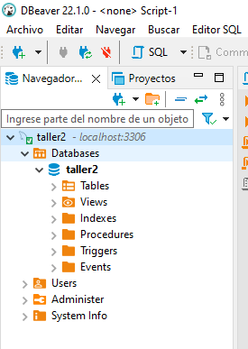

<h1 align="center"><strong>Taller Práctico 2: Modelo - Vista - Controlador</strong></h1>

## __Introducción__

En el anterior taller, donde se detalló la construcción de un prototipo Ecommerce basado en Amazon, se logró construir una lógica inicial que permitiera interactuar con una serie de productos y comentarios creados manualmente como objetos Java. 

En el presente taller, adaptaremos dicha lógica con el _Modelo_, a través de una comunicación con base de datos MySQL con Spring Data JPA e Hibernate. Adicional, trabajaremos con Spring Profiles para el manejo de diferentes ambientes de trabajo. Uno de _testing_ y otro de _desarrollo_.

## __1. Ajustes generales__

Iniciaremos con un cambio en la configuración del proyecto. Actualmente, estamos manejando la cofiguración a través del archivo: _application.properties_; en su lugar, lo cambiaremos por: __application.yml__, en donde estipularemos los diferentes ambientes de trabajo:

```yaml
server:
  port: 8000

spring:
  profiles:
    active: dev

---

spring:
  profiles: test
  datasource:
    url: jdbc:h2:mem:testdb
    username: sa
    password: password
  jpa:
    hibernate:
      ddl-auto: create-drop
    database-platform: org.hibernate.dialect.H2Dialect
    show-sql: true

---

spring:
  profiles: dev
  datasource:
    driver-class-name: com.mysql.jdbc.Driver
    url: jdbc:mysql://localhost:3306/taller2
    username: jdarguello
    password: ejemplo123
  jpa:
    hibernate:
      ddl-auto: update
    show-sql: true
```

Cada ambiente de trabajo tiene su propio sistema de gestión de bases de datos: el de testing, utiliza H2 y el de desarrollo la base de datos MySQL.

### 1.1 Base de datos MySQL

Para la base de datos MySQL utiliaremos __Podman__. Podman es una motor _daemonless_ para la creación, desarrollo y manejo de contenedores; similar a Docker. Para la creación de la base de datos, correremos el siguiente comando:

```cmd 
podman run --name taller2 -p 3306:3306 -e MYSQL_ROOT_PASSWORD=password -e MYSQL_USER=jdarguello -e MYSQL_PASSWORD=ejemplo123 -e MYSQL_DATABASE=taller2 -d docker.io/mysql
```

Una vez instalado Podman en el ordenador, y ejecutado el comando anterior, tendremos una base de datos MySQL lista para trabajar en nuestro desarrollo. El nombre de la base de datos será __taller2__. Procedemos a abrir la base de datos en un sistema de gestión, como DBeaver, de la siguiente forma:


<p align="center">Figura 1. Conexión a nueva base de datos.</p>

En el menú mostrado en la Figura 2, llenamos la información de conexión de la siguiente forma:


<p align="center">Figura 2. Configuración de conexión.</p>

Antes de presionar sobre el botón "Finalizar", debemos realizar una última configuración para poder utilizar la base de datos, que consiste en habilitar, en __true__ el comando _"allowPublicKeyRetrieval"_, como se muestra en la Figura 3.


<p align="center">Figura 3. Configuración del driver.</p>

Una vez hecho esto, podemos hacer click en __"Finalizar"__, y con ello ya tendremos acceso a la base de datos creada desde Podman.



<p align="center">Figura 4. Base de datos.</p>

### 1.2 Información inicial

Ahora, crearemos las tablas en base de datos y rellenaremos una información inicial.

```roomsql
CREATE TABLE comentario (
    comentario_id INTEGER not null, 
    calificacion DOUBLE not null, 
    contenido TEXT not null, 
    usuario VARCHAR(200) not null, 
    producto_id INTEGER not null, 
    primary key (comentario_id));
```

Y para la tabla _Producto_:

```roomsql
CREATE TABLE producto (
    producto_id INTEGER not null, 
    calificacion DOUBLE, 
    disponible boolean not null, 
    foto VARCHAR(300) not null, 
    foto_catalogo VARCHAR(300) not null, 
    nombre VARCHAR(200) not null, 
    precio double not null, 
    primary key (producto_id));
```

Empezaremos creando tres productos:

```roomsql
INSERT INTO producto 
VALUES  (1, 0.0, 1, "https://m.media-amazon.com/images/I/81WnMBnbWSL._AC_UX500_.jpg", "https://images-na.ssl-images-amazon.com/images/I/81WnMBnbWSL._AC_UL450_SR450,320_.jpg", "Crocs zuecos", 100000.0),
		(2, 0.0, 1, "https://m.media-amazon.com/images/I/710o0VupScL._AC_UX522_.jpg", "https://images-na.ssl-images-amazon.com/images/I/710o0VupScL._AC_UL450_SR450,320_.jpg", "Gildan Ultra Cotton", 250000.0),
		(3, 0.0, 1, "https://m.media-amazon.com/images/I/61fdvKHPWBL._AC_UY500_.jpg", "https://images-na.ssl-images-amazon.com/images/I/61fdvKHPWBL._AC_UL450_SR450,320_.jpg", "Hey Dude - Zapatos", 200000.0);
```

Y, para uno de los productos, crearemos los siguientes comentarios:

```roomsql
INSERT INTO comentario 
VALUES  (1, 5.0, "Excelentes crocs. Muy feliz.", "johalopez@correo.com", 1),
		(2, 3.5, "Se me rompió al mes...", "federica@correo.com", 1);
```

### 1.3 Dependencias

Para finalizar, debes asegúrarte que las dependencias del proyecto sean las siguientes:

```xml
<dependencies>
    <dependency>
        <groupId>org.springframework.boot</groupId>
        <artifactId>spring-boot-starter-thymeleaf</artifactId>
    </dependency>
    <dependency>
        <groupId>org.springframework.boot</groupId>
        <artifactId>spring-boot-starter-web</artifactId>
    </dependency>

    <dependency>
        <groupId>org.springframework.boot</groupId>
        <artifactId>spring-boot-starter-data-jpa</artifactId>
    </dependency>

    <dependency>
        <groupId>com.h2database</groupId>
        <artifactId>h2</artifactId>
        <scope>runtime</scope>
    </dependency>

    <!-- https://mvnrepository.com/artifact/mysql/mysql-connector-java -->
    <dependency>
        <groupId>mysql</groupId>
        <artifactId>mysql-connector-java</artifactId>
        <version>8.0.29</version>
    </dependency>

    <dependency>
        <groupId>org.projectlombok</groupId>
        <artifactId>lombok</artifactId>
        <version>1.18.24</version>
        <scope>provided</scope>
    </dependency>

    <dependency>
        <groupId>org.springframework.boot</groupId>
        <artifactId>spring-boot-starter-test</artifactId>
        <scope>test</scope>
    </dependency>
</dependencies>
```

### 1.4 Distribución del proyecto

Al finalizar el presente taller, la estructura del proyecto debería ser la siguiente:


<p align="center">Figura 5. Distribución del proyecto.</p>


## __2. Adaptación de modelos: Hibernate__

Una vez establecida la configuración anterior, iniciaremos reajustando nuestros modelos con las etiquetas __Hibernate__ y __Lombok__. Las tablas que relacionarán las clases _Comentario_ y _Producto_ se pueden apreciar en la Figura 5.


<p align="center">Figura 6. Tablas SQL.</p>


Para la clase _Comentario_, tendríamos:

```java
package com.Amazon.Ecommerce.Modelo;

import lombok.*;
import org.hibernate.annotations.NaturalId;

import javax.persistence.*;

@Entity
@Table(name = "Comentario")
@Data
@AllArgsConstructor
@NoArgsConstructor
@Builder
public class Comentario {
    @Id
    @SequenceGenerator(
            name = "comentario_sequence",
            sequenceName = "comentario_sequence",
            allocationSize = 1
    )
    @GeneratedValue(
            strategy = GenerationType.SEQUENCE,
            generator = "comentario_sequence"
    )
    @Column(name = "comentario_id", columnDefinition = "INTEGER")
    private Integer comentarioId;

    @Column(nullable = false, columnDefinition = "VARCHAR(200)")
    private String usuario;

    @Column(nullable = false, columnDefinition = "TEXT")
    private String contenido;

    @Column(nullable = false, columnDefinition = "DOUBLE")
    private double calificacion;

    @ManyToOne(cascade = CascadeType.ALL, fetch = FetchType.EAGER)
    @JoinColumn(
            name = "productoId",
            referencedColumnName = "producto_id",
            nullable = false
    )
    @ToString.Exclude
    private Producto producto;
}
```

Como podemos observar, el atributo _producto_, que presenta una relación __ManyToOne__ (ver Figura 5), se vincula en la tabla SQL a través de la columna referenciada __producto_id__, que es un argumento No Nulo. Adicional, se informa que este argumento modifica el atributo _productoId_ en la clase Producto.

Para la clase _Producto_:

```java
package com.Amazon.Ecommerce.Modelo;

import com.Amazon.Ecommerce.Servicios.Funciones;
import lombok.*;

import javax.persistence.*;
import java.util.ArrayList;
import java.util.List;

@Entity
@Table(name = "Producto", uniqueConstraints = {
        @UniqueConstraint(name = "nombre_precio", columnNames = {"nombre", "precio"})
})
@Data
@AllArgsConstructor
@NoArgsConstructor
@Builder
public class Producto {
    @Id
    @SequenceGenerator(
            name = "producto_sequence",
            sequenceName = "producto_sequence",
            allocationSize = 1
    )
    @GeneratedValue(
            strategy = GenerationType.SEQUENCE,
            generator = "producto_sequence"
    )
    @Column(name = "producto_id", columnDefinition = "INTEGER")
    private Integer productoId;

    @Column(nullable = false, columnDefinition = "VARCHAR(200)")
    private String nombre;

    @Column(nullable = false)
    private Double precio;

    @Column(nullable = false)
    private Boolean disponible;

    @Column(nullable = false, columnDefinition = "VARCHAR(300)")
    private String foto;

    @Column(name = "foto_catalogo", nullable = false, columnDefinition = "VARCHAR(300)")
    private String fotoCatalogo;

    @OneToMany(mappedBy = "producto", fetch = FetchType.EAGER, cascade = CascadeType.ALL)
    private List<Comentario> comentarios;

    @Column(columnDefinition = "DOUBLE")
    private Double calificacion = 0.0;

    public double getCalificacion() {
        this.calificacion = 0.0;
        if (this.comentarios != null && this.comentarios.size() > 0) {
            for (Comentario comentario : this.comentarios) {
                this.calificacion += comentario.getCalificacion();
            }
            this.calificacion /= this.comentarios.size();
        }
        return this.calificacion;
    }

    public void addComentario(Comentario comentario) {
        if (this.comentarios == null) {
            this.comentarios = new ArrayList<>();
        }
        this.comentarios.add(comentario);
    }

    public void addComentario(List<Comentario> comentarios) {
        if (this.comentarios == null) {
            this.comentarios = new ArrayList<>();
        }
        this.comentarios.addAll(comentarios);
    }
}
```

En la clase _Producto_, especificamos la relación __OneToMany__, en donde se especifica que está relacionada con el atributo _producto_ en la clase _Comentario_. Adicional, específicamos __"EAGER"__ como tipo de retorno de datos; lo que quiere decir que nos retornará toda la lista de comentarios desde la base de datos. Finalmente, especificamos __CascadeType.ALL__ que nos permitirá almacenar nuevos comentarios desde la clase _Producto_ y eliminarlos, llegado el caso se elimine el producto en base de datos.

Adicional a ello, creamos tres métodos personalizados: 

* __getCalificacion()__: retornará la calificación actualizada con base en los comentarios obtenidos desde base de datos.
* __addComentario(Comentario comentario)__: nos permitirá añadir un nuevo comentario.
* __addComentario(List<Comentario> comentarios)__: permitirá añadir una lista de nuevos comentarios.

Para probar la funcionalidad de los métodos, creamos el siguiente test unitario:

```java
package com.Amazon.Ecommerce.Modelo;

import org.junit.jupiter.api.BeforeAll;
import org.junit.jupiter.api.Test;

import java.util.ArrayList;
import java.util.Arrays;
import java.util.List;

import static org.junit.jupiter.api.Assertions.*;

class ProductoTest {

    private static List<Comentario> comentarios;

    @BeforeAll
    public static void setUpClass() {
        Comentario prueba = Comentario.builder()
                .calificacion(3.2)
                .usuario("prueba")
                .contenido("ble")
                .build();
        Comentario prueba2 = Comentario.builder()
                .calificacion(4.3)
                .usuario("prueba2")
                .contenido("ble")
                .build();
        comentarios = new ArrayList<>(Arrays.asList(
                prueba,
                prueba2
        ));
    }

    @Test
    public void testCalificacionSinComentarios() {
        Producto pera = new Producto();
        assertEquals(0, pera.getCalificacion());
    }

    @Test
    public void testCalificacion () {
        Producto manzana = new Producto();
        manzana.setComentarios(comentarios);

        assertEquals((3.2+4.3)/2, manzana.getCalificacion());
    }
}
```

## __3. Repositorios__

Para las operaciones CRUD, habilitaremos repositorios tanto para comentarios como para productos.

Para el _Comentario_:

```java
package com.Amazon.Ecommerce.Repositorios;

import com.Amazon.Ecommerce.Modelo.Comentario;
import com.Amazon.Ecommerce.Modelo.Producto;
import org.springframework.data.jpa.repository.JpaRepository;

import java.util.List;

public interface ComentarioRepo extends JpaRepository<Comentario, Integer> {
    List<Comentario> findByProducto(Producto producto);
}
```

En la clase _ComentarioRepo_ creamos un método que permita filtrar los comentarios para catalogarlos por _producto_.

Y, para el _Producto_:

```java
package com.Amazon.Ecommerce.Repositorios;

import com.Amazon.Ecommerce.Modelo.Producto;
import org.springframework.data.repository.CrudRepository;

import java.util.List;

public interface ProductoRepo extends CrudRepository<Producto, Integer> {

    Producto findById(int id);

    Producto findByNombre(String nombre);

    Producto findByNombreAndPrecio(String nombre, double precio);

    List<Producto> findAll();
}
```

## __4. Servicios__

Los servicios se tratan de desarrollos genéricos para facilitar el desarrollo de actividades diversas. Crearemos dos servicios para garantizar el manejo adecuado de operaciones CRUD: uno para los comentarios y otro para los productos.

Para los comentarios:

```java
package com.Amazon.Ecommerce.Servicios;

import com.Amazon.Ecommerce.Modelo.Comentario;
import com.Amazon.Ecommerce.Modelo.Producto;
import com.Amazon.Ecommerce.Repositorios.ComentarioRepo;
import org.springframework.beans.factory.annotation.Autowired;
import org.springframework.stereotype.Service;

import java.util.List;

@Service
public class ComentarioService {

    @Autowired
    private ComentarioRepo comentarioRepo;

    public List<Comentario> getComentarios(Producto producto) {
        return comentarioRepo.findByProducto(producto);
    }

    public void guardarComentario(Comentario comentario) {
        comentarioRepo.save(comentario);
    }

    public void guardarComentario(Comentario comentario, Producto producto) {
        comentario.setProducto(producto);
        this.guardarComentario(comentario);
    }
}
```

Se emplea la etiqueta __@Service__ con la finalidad que Spring Boot lo que reconozca como un servicio y permita su inyección en el controlador.

Para los _productos_:

```java
package com.Amazon.Ecommerce.Servicios;

import com.Amazon.Ecommerce.Modelo.Comentario;
import com.Amazon.Ecommerce.Modelo.Producto;
import com.Amazon.Ecommerce.Repositorios.ProductoRepo;
import org.springframework.beans.factory.annotation.Autowired;
import org.springframework.stereotype.Service;

import java.util.ArrayList;
import java.util.Arrays;
import java.util.List;

@Service
public class ProductoService {
    @Autowired
    private ProductoRepo productoRepo;

    @Autowired
    private ComentarioService comentarioService;

    public void crearProducto(Producto producto) {
        productoRepo.save(producto);
    }

    public void crearProducto(Producto producto, List<Comentario> comentarios) {
        comentarios.forEach(comentario -> {
            comentario.setProducto(producto);
        });
        producto.addComentario(comentarios);
        this.crearProducto(producto);
    }

    public void addComentarios(Producto producto, Comentario... comentarios) {
        Producto ref = productoRepo.findByNombreAndPrecio(producto.getNombre(), producto.getPrecio());
        if (ref != null) {
            this.updateComentariosDelProducto(ref, Arrays.asList(comentarios));
        } else {
            this.crearProducto(producto, Arrays.asList(comentarios));
        }
    }

    public void updateComentariosDelProducto(Producto producto, List<Comentario> comentarios) {
        this.crearProducto(producto, comentarios);
    }

    public void delete(Producto producto) {
        productoRepo.delete(producto);
    }

    public Producto getProducto(String nombre, double precio) {
        Producto producto = productoRepo.findByNombreAndPrecio(nombre, precio);
        return producto;
    }

    public Producto getProducto(int id) {
        return productoRepo.findById(id);
    }

    public ProductoRepo getProductoRepo() {
        return this.productoRepo;
    }

    public List<Producto> getProductos() {
        return this.productoRepo.findAll();
    }

    public void deleteAll() {
        this.productoRepo.deleteAll();
    }

}
```

Realizamos los siguientes test unitarios para garantizar la funcionalidad del servicio de productos:

```java
package com.Amazon.Ecommerce.Servicios;

import com.Amazon.Ecommerce.Modelo.Comentario;
import com.Amazon.Ecommerce.Modelo.Producto;
import com.Amazon.Ecommerce.Repositorios.ComentarioRepo;
import org.junit.jupiter.api.AfterAll;
import org.junit.jupiter.api.AfterEach;
import org.junit.jupiter.api.BeforeEach;
import org.junit.jupiter.api.Test;
import org.springframework.beans.factory.annotation.Autowired;
import org.springframework.boot.test.autoconfigure.orm.jpa.DataJpaTest;
import org.springframework.boot.test.context.SpringBootTest;
import org.springframework.test.context.ActiveProfiles;

import static org.junit.jupiter.api.Assertions.*;

@SpringBootTest
@ActiveProfiles(profiles = "test")
class ProductoServiceTest {

    @Autowired
    private ProductoService productoService;

    private Producto camisa;
    private Comentario luisa;
    private Comentario lola;

    @BeforeEach
    public void setUp() {
        productoService.deleteAll();
        camisa = Producto.builder()
                .precio(1000.0)
                .nombre("Camisa")
                .foto("...")
                .fotoCatalogo(",,,")
                .disponible(true)
                .build();

        luisa = Comentario.builder()
                .calificacion(3.5)
                .usuario("luisa@coreo.com")
                .contenido("Bueno")
                .build();

        lola = Comentario.builder()
                .calificacion(4.0)
                .usuario("lola@correo.com")
                .contenido("Maso")
                .build();
    }

    @AfterEach
    public void tearDown() {
        productoService.delete(camisa);
    }

    @Test
    public void guardarProductoNoExisteConComentarios() {
        productoService.addComentarios(camisa, luisa, lola);

        Producto camisa = productoService.getProducto("Camisa", 1000.0);

        assertEquals(2, camisa.getComentarios().size());
    }

    @Test
    public void ActualizarProductoExistenteConComentarios() {
        productoService.addComentarios(camisa, luisa);

        productoService.addComentarios(camisa, lola);

        Producto camisa = productoService.getProducto("Camisa", 1000.0);

        assertAll(
                () -> assertEquals(2, camisa.getComentarios().size()),
                () -> assertEquals(1, productoService.getProductos().size())
        );
    }

}
```

Para el uso de servicios, debemos realizar un test de integración con __@SpringBootTest__. Adicionamos _@ActiveProfiles_ para especificar que se utilice la base de datos de pruebas, que emplea H2.

## __5. Ajuste de controladores__

Ahora, ajustaremos los controladores existentes para que utilicen los servicios creados anteriormente y operen con los datos procedentes de nuestras bases de datos.

```java
package com.Amazon.Ecommerce.Controlador;

import com.Amazon.Ecommerce.Modelo.Comentario;
import com.Amazon.Ecommerce.Modelo.Producto;
import com.Amazon.Ecommerce.Servicios.Funciones;
import com.Amazon.Ecommerce.Servicios.ProductoService;
import org.springframework.beans.factory.annotation.Autowired;
import org.springframework.stereotype.Controller;
import org.springframework.ui.Model;
import org.springframework.web.bind.annotation.GetMapping;
import org.springframework.web.bind.annotation.RequestParam;

import java.util.ArrayList;
import java.util.Arrays;
import java.util.List;

@Controller
public class ProductosController {

    @Autowired
    private ProductoService productoService;

    @GetMapping("/catalogo")
    public String getCatalogo(@RequestParam(value = "id", required = false,
                                defaultValue = "") Integer id, Model model) {
        if (id != null) {
            model.addAttribute("producto", productoService.getProducto(id));
            return "Producto";
        } else {
            model.addAttribute("productos", productoService.getProductos());
            return "Catalogo";
        }
    }
}
```

Como se puede observar, la obtención de datos se produce con base en el __servicio de productos__. Para corroborar el correcto funcionamiento del controlador, empleamos los siguientes test unitarios.

```java
package com.Amazon.Ecommerce.Controlador;

import com.Amazon.Ecommerce.Modelo.Producto;
import com.Amazon.Ecommerce.Servicios.ProductoService;
import org.junit.jupiter.api.BeforeEach;
import org.junit.jupiter.api.Test;
import org.springframework.beans.factory.annotation.Autowired;
import org.springframework.boot.test.autoconfigure.orm.jpa.DataJpaTest;
import org.springframework.boot.test.autoconfigure.web.servlet.AutoConfigureMockMvc;
import org.springframework.boot.test.autoconfigure.web.servlet.WebMvcTest;
import org.springframework.boot.test.context.SpringBootTest;
import org.springframework.http.MediaType;
import org.springframework.test.context.ActiveProfiles;
import org.springframework.test.web.servlet.MockMvc;

import java.awt.*;
import java.util.Arrays;

import static org.springframework.test.web.servlet.request.MockMvcRequestBuilders.get;

import static org.junit.jupiter.api.Assertions.*;
import static org.springframework.test.web.servlet.result.MockMvcResultMatchers.*;

@SpringBootTest
@AutoConfigureMockMvc
@ActiveProfiles(profiles = "test")
class ProductosControllerTest {

    @Autowired
    private MockMvc mock;

    @Autowired
    private ProductoService productoService;

    private Producto crocsZuecos;

    @BeforeEach
    public void setUp() {
        productoService.deleteAll();
        crocsZuecos = Producto.builder()
                .productoId(1)
                .nombre("Crocs zuecos")
                .foto("...")
                .fotoCatalogo(",,,")
                .disponible(true)
                .calificacion(0.0)
                .precio(200_000.0)
                .build();
        productoService.crearProducto(crocsZuecos);
    }

    @Test
    public void testCatalogo() throws Exception {
        mock.perform(get("/catalogo").accept(MediaType.TEXT_HTML))
                .andExpect(status().isOk())
                .andExpect(view().name("Catalogo"))
                .andExpect(model().attributeExists("productos"));
    }

    @Test
    public void testProducto() throws Exception {
        mock.perform(get("/catalogo").param("id", "1").accept(MediaType.TEXT_HTML))
                .andExpect(status().isOk())
                .andExpect(view().name("Producto"))
                .andExpect(model().attributeExists("producto"));
    }
}
```

De aprobar todos los test, significa que nuestra aplicación es saludable. Para finalizar, corremos la aplicación principal (__EcommerceApplication__) y corroboramos su funcionalidad.

__Para tener en cuenta:__ el contenedor con la base de datos MySQL debe estar corriendo, de lo contrario nos aparecerá un error.

Si todo funciona correctamente, nuestra aplicación debería mostrar lo siguiente al correr el navegador con URL: http://localhost:8000/catalogo.


<p align="center">Figura 7. Resultado final.</p>


## __Conclusiones__

Si bien no se percibe un "nuevo desarrollo" desde el punto de vista frontend, logramos reajustar nuestra aplicación para que la recepción de datos fuese directamente desde una base de datos MySQL, en lugar de objetos Java construidos desde el controlador.

Logramos aprender nuevos conceptos en esta trayectoria:

1. Aprendimos cómo dividir nuestra aplicación en diferentes ambientes de trabajo; y, con ello, mejorar nuestras habilidades de desarrollo. Ambientes construidos:
   1. Testing.
   2. Desarrollo.
2. Aplicamos Hibernate y Spring Data JPA como herramientas de acceso y manipulación de datos.
3. Entendimos la utilidad de los _Servicios_ como herramientas de desarrollo que, al encargarse de tareas puntuales, mejoran la calidad y legibilidad de nuestro código.
4. Introdujimos el concepto de _test de integración_, a través de @SpringBootTest, para analizar la forma en cómo se comunican nuestros componentes de software.
